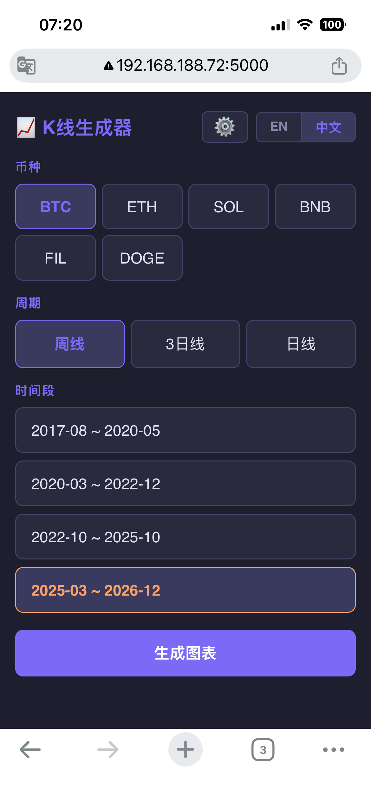
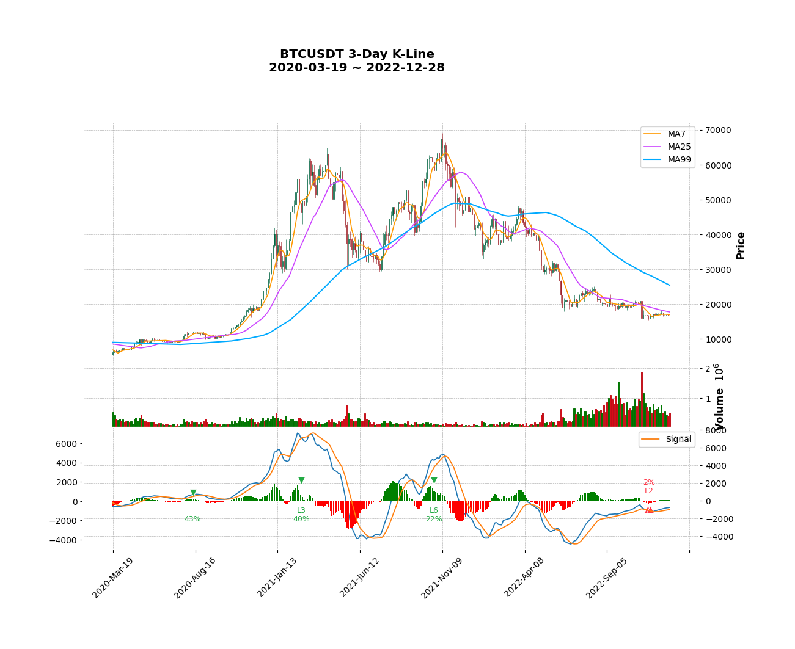
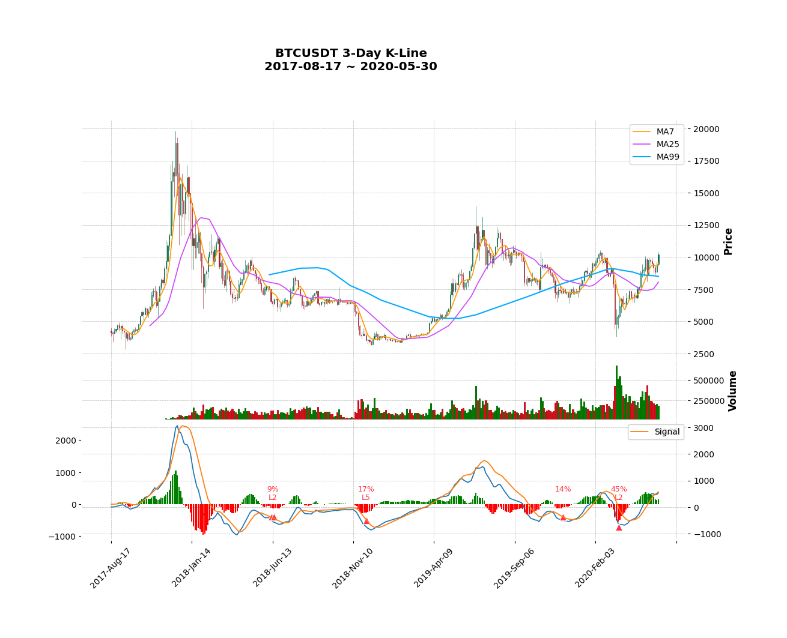

# 公理化交易体系——可视化工具

这是一套对价格行为交易框架的公理化形式化,以及基于该框架的可视化代码实现。
最初是为加密货币长线持有者(holder)设计的,目的是给"市场结构"提供一种
精确的、可证伪的语言。

> **English README:** [README.md](README.md)
> **理论文档:** [docs/THEORY_ZH.md](docs/THEORY_ZH.md)
> **Theory in English:** [docs/THEORY.md](docs/THEORY.md)

---

## 这个项目是什么

由两部分组成:

1. **理论文档** —— 一套对价格行为框架的公理化形式化,分为六层
   (公理 → 结构 → 状态 → 转折 → 预测 → 执行)。每个概念定义到可以被
   代码实现、或者被反例证伪的程度。见 [docs/THEORY_ZH.md](docs/THEORY_ZH.md)。

2. **参考实现** —— 一套 Python 代码,在 K 线数据上检测三段结构和背离,
   把它们标注在 K 线 + MACD 图上,并支持在嵌套时间尺度上层层钻取
   (周线 → 3 日线 → 日线 → 4小时 → ... → 15 分钟)。实现里包括一条
   非平凡的"反向屏障规则",用于过滤层级背离 —— 见 `divergence.py`。

## 这个项目**不是**什么

- **不是交易信号源。** 图上的标注是结构标记,不是交易指令。
- **不是自动化交易系统。** 没有 API 接入,没有下单执行,没有仓位管理。
  作者认为这些超出了项目意图,且与项目精神相悖。
- **不是经过回测的策略。** 不主张任何统计绩效。该框架在实战中是否盈利,
  是一个开放问题,本项目不回答。
- **不是高频交易工具。** 框架的假设(清晰的三段结构、有意义的 MACD
  面积积累)适用于长周期(日线及以上)。短周期使用不被支持也不被鼓励。

## 维护说明

**本项目作为完成态作品发布,作者不计划维护。**

- Issues 与 Pull Requests 不会被审阅。
- Bug 报告不会被回复。
- 功能请求不会被考虑。
- 使用问题不会被回答。

如果你觉得这份工作有用,鼓励你 **fork 后自行开发**。MIT 许可证允许这一切。

这是有意为之,不是疏忽。作者希望这份工作以"参考资料"的形式存在,
而不是以"持续服务"的形式存在。

---

## 安装

需要 Python 3.9 或更新版本。

```bash
git clone https://github.com/f0133833/uniark-trading-system.git uniark
cd uniark
pip install -r requirements.txt
```

依赖:

- `python-binance` —— 从 Binance 拉取 K 线数据
- `pandas`、`numpy` —— 数据处理
- `mplfinance`、`matplotlib` —— 图表渲染
- `flask` —— Web UI(可选;只有 `app.py` 需要)
- `tkinter` —— 桌面 UI(通常随 Python 自带;某些 Linux 发行版需要
  额外安装 `python3-tk`)

## 使用方法

### 桌面 UI

```bash
python main.py
```

打开 Tkinter 窗口。选择币种、入口周期(周线 / 3 日线 / 日线)、时段,
点"生成图表" —— 生成的 PNG 会用系统看图器打开。UI 进入钻取模式,
顶层每一段都可以点击,以更细的周期渲染其子段。

### Web UI

```bash
python app.py
```

然后在浏览器打开 `http://127.0.0.1:5000`。和桌面 UI 工作流一致,
只是在浏览器里。

## 项目演示

### 主界面
![主界面截图]

### K线 + MACD 背离标注示例（牛市背离）
![牛市背离示例]

### 熊市背离示例
![熊市背离示例]

### 多时间框架钻取演示

```

完整返回字段见 `find_three_segment_divergences` 的 docstring。

---

## 可视化标记

MACD 面板上的背离标注:

| 标记 | 含义 |
|------|------|
| ▲ 红 | 底背离(潜在向上反转) |
| ▼ 绿 | 顶背离(潜在向下反转) |
| 双三角 | 力度衰竭在多尺度同时成立(更强信号) |
| 蓝色文字 + `?` | 暂定信号 —— 末段可能继续延伸 |
| `L2`、`L3` ... | 分层级别(L1 不显示) |
| 百分比 | 力度比 S<sub>last</sub> / Σ S<sub>同向段</sub> |

箭头锚定在 hist 极值柱旁;级别和百分比文字搬到 0 轴对侧,
保持 hist 周边视觉清爽。

---

## 项目结构

```
.
├── README.md                  ← 英文 README
├── README_zh.md               ← 中文 README(本文件)
├── LICENSE                    ← MIT 许可证
├── requirements.txt
├── docs/
│   ├── THEORY.md              ← 英文理论文档
│   └── THEORY_ZH.md           ← 中文理论文档(原版)
├── data.py                    ← Binance K 线拉取
├── indicator.py               ← EMA、MACD 计算
├── divergence.py              ← 核心算法(注释详尽)
├── plot.py                    ← 基础绘图(遗留)
├── plot_helpers.py            ← 背离标注辅助
├── plot_kline.py              ← 多币种多周期渲染
├── navigation.py              ← 钻取导航逻辑
├── settings.py                ← 用户设置持久化
├── settings_dialog_tk.py      ← Tkinter 设置对话框
├── main.py                    ← 桌面 UI 入口
├── app.py                     ← Web UI 入口(Flask)
└── user_settings.json         ← 默认用户设置
```

项目的算法核心在 [`divergence.py`](divergence.py)。如果你想理解或
扩展核心逻辑,从那里开始 —— 模块级别的 docstring 详细说明了
分层扩展和反向屏障规则。

---

## 免责声明

本软件按"现状"提供,不附带任何形式的担保,具体见 MIT 许可证。
**本项目任何部分都不构成财务建议。** 加密货币交易存在重大亏损风险;
基于本软件做出的任何决策,使用者自行承担全部责任。

本项目并未对所形式化的框架进行严格回测验证。任何想用它做实盘决策的
读者,强烈建议:

- 自行做统计验证(包含真实成本:滑点、手续费、税费)。
- 与买入持有等被动基准对比。
- 认识到"在历史图上视觉上很漂亮的标注"不意味着"在前向交易中能赚钱"。

---

## 许可证

[MIT 许可证](LICENSE)。你可以自由使用、修改、分发、商用,需附带署名,
不附带担保。

---

## 致谢

理论框架从中文技术分析社区的价格行为与结构分析传统中得到启发。
本项目的贡献在于公理化的重新组织和参考实现,而不是关于市场结构的
原始直觉。

代码实现是在 Claude(Anthropic)作为编程协作者的帮助下完成的。
